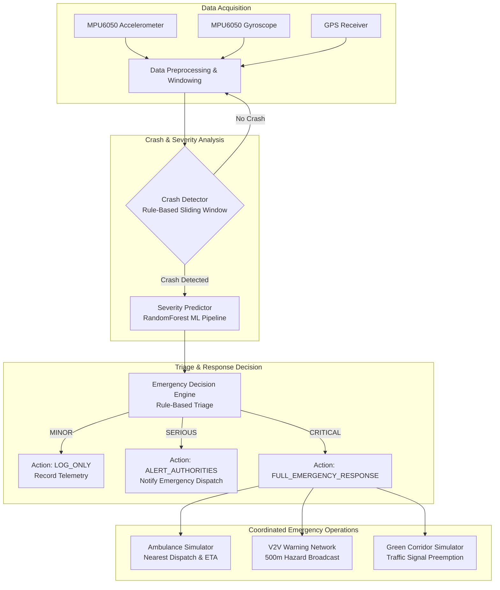

# Vehicle Accident Detection, Severity Prediction & Emergency Response System

An end-to-end software simulation pipeline designed for rapid vehicular crash detection, severity classification, and automated multi-tier emergency response coordination.

---

## 1. Project Overview

Traffic accidents require rapid, coordinated emergency intervention to minimize fatalities and severe trauma during the critical "Golden Hour." Traditional emergency response relies heavily on manual reporting or bystander intervention, leading to delays and inaccurate triage information.

This capstone project implements an intelligent, closed-loop telemetry and emergency response system that:
1. **Monitors** live kinematic vehicle dynamics (acceleration, rotational velocity, jerk).
2. **Detects** vehicular collisions in real time using a multi-criteria sliding window algorithm.
3. **Predicts** accident severity (`MINOR`, `SERIOUS`, `CRITICAL`) using a machine learning model trained on national crash investigation data.
4. **Dispatches** an automated emergency response strategy: selective emergency authority alerting, nearest ambulance dispatch, Vehicle-to-Vehicle (V2V) hazard broadcasts, and dynamic Green Corridor traffic signal preemption.

The entire end-to-end pipeline is implemented as a modular software simulation demonstrator, structured to seamlessly interface with physical IoT hardware (e.g., ESP32 with MPU6050 and GPS) in future deployments.

---

## 2. System Workflow

The system operates across a sequential, real-time pipeline from raw telemetry streaming to coordinated urban emergency response:



---

## 3. Sensors Used

The system architecture utilizes three primary sensory telemetry streams. In the current release, all sensor inputs are **software-simulated** via [`src/live_sensor_simulator.py`](file:///d:/College/Capstone/Capstone-Project_ML/src/live_sensor_simulator.py) and [`src/location_simulator.py`](file:///d:/College/Capstone/Capstone-Project_ML/src/location_simulator.py), with physical impact physics modeled directly from real driving statistics.

| Sensor | Channels Measured | Function & Purpose | Implementation Status |
| :--- | :--- | :--- | :--- |
| **MPU6050 Accelerometer** | 3-Axis Linear Acceleration ($A_x, A_y, A_z$ in $g$) | Computes total acceleration magnitude $\|A\|$, longitudinal/lateral impact vectors, dynamic acceleration change ($\Delta A$), and jerk. Detects abrupt collision deceleration spikes (30g–60g). | **Simulated** (Statistical sampling from real driving data + 4-phase physical crash model) |
| **MPU6050 Gyroscope** | 3-Axis Angular Velocity ($\omega_x, \omega_y, \omega_z$ in $\text{rad/s}$) | Computes rotational rate magnitude $\|\Omega\|$ to identify vehicle spin, rollover events, and rapid post-impact yaw/pitch/roll instability. | **Simulated** (Learned normal/aggressive variance + simulated peak rotational rates up to 35 rad/s) |
| **GPS Module** | Geodetic Coordinates (Latitude, Longitude), Heading, Speed | Tracks vehicle trajectory, computes inter-vehicle and vehicle-to-hospital distances via Haversine formulation, and captures fixed crash coordinates upon collision. | **Simulated** (Kinematic dead-reckoning engine with location freeze upon collision trigger) |

> **Hardware Readiness**: The software simulator outputs structured JSON/dataclass schemas identical to an ESP32 micro-controller stream, allowing physical MPU6050 I2C sensors and UART GPS modules to be plugged in without refactoring the detection core.

---

## 4. Dataset Structure

The repository maintains raw public crash and motion datasets, derived feature matrices, and runtime telemetry logs:

| Dataset / File Path | Features | Target / Label | Purpose | Nature |
| :--- | :--- | :--- | :--- | :--- |
| [`data/raw/driving_behavior/train_motion_data.csv`](file:///d:/College/Capstone/Capstone-Project_ML/data/raw/driving_behavior/train_motion_data.csv) | 3,644 rows × 8 cols: `AccX`, `AccY`, `AccZ`, `GyroX`, `GyroY`, `GyroZ`, `Timestamp` | `Class` (`SLOW`: 1,331, `NORMAL`: 1,200, `AGGRESSIVE`: 1,113) | Baseline driving behavior training and sensor simulator distribution tuning | **Real / Public** (Kaggle) |
| [`data/raw/driving_behavior/test_motion_data.csv`](file:///d:/College/Capstone/Capstone-Project_ML/data/raw/driving_behavior/test_motion_data.csv) | 3,084 rows × 8 cols: `AccX`, `AccY`, `AccZ`, `GyroX`, `GyroY`, `GyroZ`, `Timestamp` | `Class` (`SLOW`: 1,273, `NORMAL`: 997, `AGGRESSIVE`: 814) | Out-of-sample evaluation of driving behavior classification | **Real / Public** (Kaggle) |
| [`data/processed/driving_features.csv`](file:///d:/College/Capstone/Capstone-Project_ML/data/processed/driving_features.csv) | 363 window records × 38 cols (37 statistical features per 20-sample window: mean, std, min, max of axes, magnitudes, and jerk) | `Class` | Processed feature set used to train the driving pattern model | **Derived** from public data |
| [`data/raw/ciren/*.sas7bdat`](file:///d:/College/Capstone/Capstone-Project_ML/data/raw/ciren) | 13 SAS tables (including `case`, `gv`, `ve`, `injury`, `acc_desc`, `scenario`) | Multiple engineering & medical metrics (Delta-V, crush, damage extent, MAIS) | Raw source data from federal in-depth crash investigation cases | **Real / Public** (NHTSA CIREN) |
| [`data/processed/ciren_severity.csv`](file:///d:/College/Capstone/Capstone-Project_ML/data/processed/ciren_severity.csv) | 2,101 rows × 53 cols: Delta-V components (`DVEST`, `DVTOTAL`, `DVLAT`, `DVLONG`), energy, curb weight, road conditions, crush profile (`DVC1`–`DVC6`) | `SEVERITY` (`SERIOUS`: 1,616, `MINOR`: 321, `CRITICAL`: 164) mapped from `MAIS` | Consolidated dataset for training the multi-class severity prediction model | **Derived** from NHTSA CIREN SAS tables |
| [`data/live/live_sensor_data_*.csv`](file:///d:/College/Capstone/Capstone-Project_ML/data/live) | 15 telemetry cols (Timestamp, 3D Accel, 3D Gyro, Magnitudes, Driving Behavior, Crash Status, Confidence, Severity, Lat, Lon) | N/A (Streaming time-series) | Real-time simulation audit log generated at 20 Hz | **Simulated** (Runtime generated) |

---

## 5. Data Sources & The Role of CIREN

### Sources
1. **Driving Behavior Dataset (Kaggle)**: Smartphone/IMU accelerometer and gyroscope logs capturing normal, aggressive, and slow vehicle handling.
2. **NHTSA CIREN Database (Crash Injury Research and Engineering Network)**: Official federal crash research database sponsored by the U.S. National Highway Traffic Safety Administration (NHTSA).

### Clarification on CIREN
> **What CIREN Is**: CIREN is **not** a machine learning algorithm, neural network, or software package. It is an extensive clinical and engineering research program that links detailed vehicular damage data (collected by professional crash investigators) with medical injury outcomes (collected by trauma centers).
> 
> **How It Is Used in this Project**:
> * **Dataset Extraction**: The project ingests authentic NHTSA SAS tables (`case.sas7bdat`, `gv.sas7bdat`, `ve.sas7bdat`) via [`src/prepare_ciren_dataset.py`](file:///d:/College/Capstone/Capstone-Project_ML/src/prepare_ciren_dataset.py), joining them on unique case identifiers (`CASENO`, `VEHNO`).
> * **Target Definition**: Ground-truth crash severity labels are constructed from the clinical **MAIS** (Maximum Abbreviated Injury Scale):
>   * MAIS 1–2 $\rightarrow$ `MINOR`
>   * MAIS 3–4 $\rightarrow$ `SERIOUS`
>   * MAIS 5–6 $\rightarrow$ `CRITICAL`
> * **Sensor-to-CIREN Heuristic Mapping**: Real-time vehicle IMU sensors cannot directly measure vehicle curb weight or post-crash structural crush depths (`DVC1`–`DVC6`). Therefore, [`src/predict_severity.py`](file:///d:/College/Capstone/Capstone-Project_ML/src/predict_severity.py) acts as an engineering bridge: it computes estimated $\Delta V$ and impact kinetic energy from sensor peak acceleration and impulse duration, while supplying population medians/defaults for unobservable static environmental/vehicle variables.

---

## 6. Models Used

### 1. Crash Detection Engine (`src/crash_detector.py`)
* **Type**: **Rule-Based Sliding Window Algorithm** (deterministic signal processing).
* **Architecture**: Evaluates a 20-sample circular buffer at 20 Hz (1.0-second sliding window).
* **Criteria & Thresholds**:
  * Acceleration magnitude spike: $\|A\| > 8.0\,g$
  * Sudden acceleration delta: $|\Delta A| > 5.0\,g$
  * Angular rate threshold: $\|\Omega\| > 3.0\,\text{rad/s}$
  * Temporal persistence: $\ge 5$ consecutive anomalous samples within an impact window of 3–15 samples.
* **Output**: Categorical status (`NO_CRASH`, `POSSIBLE_CRASH`, `CRASH_DETECTED`) with a scaled heuristic confidence score ($0.0$ to $1.0$).

### 2. Crash Severity Prediction Model (`models/ciren_severity_model.pkl`)
* **Underlying Algorithm**: `RandomForestClassifier` wrapped in an `sklearn.pipeline.Pipeline`.
* **Preprocessing Pipeline**:
  * **Numeric Transformer**: Handled via `Pipeline([('imputer', SimpleImputer(strategy='median'))])` across all continuous variables (Delta-V, energy, crush deformation, speed limits).
  * **Categorical Transformer**: Handled via `Pipeline([('imputer', SimpleImputer(strategy='most_frequent')), ('encoder', OneHotEncoder(handle_unknown='ignore'))])`.
  * **Assembly**: Unified using `ColumnTransformer`.
* **Classifier Configuration**:
  * `n_estimators = 400`
  * `max_depth = 15`
  * `min_samples_split = 5`
  * `min_samples_leaf = 2`
  * `class_weight = 'balanced'` (compensating for severe class imbalance where `SERIOUS` accounts for 77% of samples)
  * `random_state = 42`

#### Target Leakage Finding & Model Validation
During model engineering, an important methodological finding was analyzed:
* **Model A (With Target Leakage)**: When post-crash hospital variables (`MAIS`, `ISS`, `FATAL`) were inadvertently included as features, the model achieved **99.3% accuracy** and **97.0% balanced accuracy**. This occurred because `SEVERITY` is directly derived from `MAIS`.
* **Model B (Honest Baseline without Leakage)**: Excluding clinical outcomes and preserving only pre-crash and crash-dynamic features yields **72.4% overall test accuracy** and **33.5% balanced accuracy** (with low standalone recall for the minority `CRITICAL` class). This represents the genuine performance baseline when deploying crash models prior to medical intervention.

### 3. Driving Behavior Classifier (`models/driving_behavior_model.pkl`)
* **Underlying Algorithm**: `RandomForestClassifier` trained on 37 statistical window features (`mean`, `std`, `min`, `max`, `jerk`).
* **Classes**: `NORMAL`, `SLOW`, `AGGRESSIVE`.
* **Performance**: Achieves **61.6% test accuracy**, with frequent overlap between `NORMAL` and adjacent driving styles.

---

## 7. System Components

The system cleanly separates machine learning inference, deterministic business rules, and software simulation abstractions:

| Component | Module | Operational Type | Description |
| :--- | :--- | :--- | :--- |
| **Accident Detection** | [`src/crash_detector.py`](file:///d:/College/Capstone/Capstone-Project_ML/src/crash_detector.py) | **Rule-Based** | Analyzes rolling acceleration/gyroscope variance and peak jerk to trigger crash flags with confidence scoring. |
| **Severity Prediction** | [`src/predict_severity.py`](file:///d:/College/Capstone/Capstone-Project_ML/src/predict_severity.py) | **ML-Based** | Executes scikit-learn Random Forest pipeline on derived impact parameters to classify severity into `MINOR`, `SERIOUS`, or `CRITICAL`. |
| **GPS / Location Tracking** | [`src/location_simulator.py`](file:///d:/College/Capstone/Capstone-Project_ML/src/location_simulator.py) | **Simulated** | Computes vehicle trajectory and speed; freezes exact coordinates upon collision trigger for emergency routing. |
| **Emergency Decision Logic** | [`src/emergency_decision.py`](file:///d:/College/Capstone/Capstone-Project_ML/src/emergency_decision.py) | **Rule-Based** | Translates severity into actionable protocols: `MINOR` $\rightarrow$ `LOG_ONLY`, `SERIOUS` $\rightarrow$ `ALERT_AUTHORITIES`, `CRITICAL` $\rightarrow$ `FULL_EMERGENCY_RESPONSE`. |
| **Ambulance Dispatch** | [`src/ambulance_simulator.py`](file:///d:/College/Capstone/Capstone-Project_ML/src/ambulance_simulator.py) | **Simulated** | Tracks a fleet of 6 distributed ambulances across a 10 km radius, calculates nearest vehicle via Haversine distance, and computes ETA at 80 km/h. |
| **V2V Communication** | [`src/v2v_simulator.py`](file:///d:/College/Capstone/Capstone-Project_ML/src/v2v_simulator.py) | **Simulated** | Broadcasts collision alerts (`ACCIDENT_AHEAD`, `EMERGENCY_APPROACHING`) to surrounding vehicles within a 500 m safety zone (1,000 m radio range). |
| **Green Corridor Coordination** | [`src/green_corridor.py`](file:///d:/College/Capstone/Capstone-Project_ML/src/green_corridor.py) | **Simulated** | Controls 4 intersection signals along the ambulance route, switching normal cyclic phases to an uninterrupted Green wave. |
| **Data Logging** | [`src/main.py`](file:///d:/College/Capstone/Capstone-Project_ML/src/main.py) | **Simulated / Logging** | Flushes 20 Hz synchronized CSV records to [`data/live/`](file:///d:/College/Capstone/Capstone-Project_ML/data/live) for auditability. |

---

## 8. Repository Structure

```text
Capstone-Project_ML/
├── context.txt                     # Project specification, research findings & notes
├── data/
│   ├── raw/
│   │   ├── ciren/                  # Official NHTSA CIREN SAS datasets (.sas7bdat, formats)
│   │   └── driving_behavior/       # Kaggle IMU motion datasets (train/test_motion_data.csv)
│   ├── processed/
│   │   ├── ciren_severity.csv      # Merged CIREN dataset (2,101 rows × 53 cols)
│   │   └── driving_features.csv    # 363 sliding window feature vectors
│   └── live/                       # Timestamped CSV logs generated during live runs
├── models/
│   ├── ciren_severity_model.pkl    # Trained RandomForest Pipeline (preprocessing + classifier)
│   ├── driving_behavior_model.pkl  # Trained RandomForest driving behavior classifier
│   └── feature_columns.pkl         # Serialized list of 37 feature column names
├── src/
│   ├── main.py                     # Master execution script (complete 45s simulation pipeline)
│   ├── crash_detector.py           # Real-time sliding window crash detection logic
│   ├── predict_severity.py         # Severity prediction & sensor-to-CIREN feature adapter
│   ├── emergency_decision.py       # Triage decision rules (MINOR / SERIOUS / CRITICAL)
│   ├── live_sensor_simulator.py    # Multi-mode IMU sensor simulation (Normal/Aggressive/Crash)
│   ├── location_simulator.py       # GPS trajectory simulation and Haversine distance engine
│   ├── ambulance_simulator.py      # Nearest-neighbor ambulance search and dispatch logic
│   ├── v2v_simulator.py            # Vehicle-to-Vehicle alert broadcasting engine
│   ├── green_corridor.py           # Traffic light preemption and green-wave coordinator
│   ├── prepare_dataset.py          # Feature extraction from raw driving motion CSVs
│   ├── prepare_ciren_dataset.py    # ETL script merging and cleaning CIREN SAS tables
│   ├── train_model.py              # Balanced Random Forest training script
│   ├── train_ciren_model.py        # Pipeline training with ColumnTransformer
│   └── test_model.py               # Unit inference test for driving behavior model
└── README.md                       # System documentation
```

---

## 9. Running the Project

### Prerequisites
* Python 3.10+ (tested on Python 3.11 / 3.12 / 3.13)
* Dependencies: `numpy`, `pandas`, `scikit-learn`, `joblib`

### Installation
Clone the repository and install required packages:

```bash
git clone <repository-url>
cd Capstone-Project_ML
pip install numpy pandas scikit-learn joblib
```

### Execution

#### 1. Run Full End-to-End Simulation Pipeline (Recommended)
Executes a 45-second scenario transitioning through **Normal Driving (0–15s)** $\rightarrow$ **Aggressive Driving (15–30s)** $\rightarrow$ **Crash Event (30s+)**, triggering severity prediction and emergency dispatch:

```bash
python src/main.py
```

#### 2. Run Individual Component Unit Tests
Each subsystem can be executed standalone to verify isolated functionality:

```bash
# Test sliding window crash detector
python src/crash_detector.py

# Test CIREN severity predictor
python src/predict_severity.py

# Test emergency triage decision engine
python src/emergency_decision.py

# Test ambulance dispatch simulation
python src/ambulance_simulator.py

# Test V2V safety broadcast network
python src/v2v_simulator.py

# Test green corridor signal preemption
python src/green_corridor.py
```

---

## 10. Example Output

When running `python src/main.py`, a simulated collision triggers the following terminal telemetry and decision sequence:

```text
============================================================
!!! CRASH DETECTED !!!
============================================================
Accident ID: ACC-20260929-192327
Confidence: 92.0%
Trigger: Max acc 32.28g > 8.0g, Acc change 32.16g > 5.0g
Location: 12.975053, 77.598165
============================================================

[SEVERITY] Analyzing crash severity...
[SEVERITY] Predicted: SERIOUS
[SEVERITY] Confidence: 81.4%

============================================================
EMERGENCY DECISION
============================================================
Severity          : SERIOUS
Action            : ALERT_AUTHORITIES
Ambulance Required: NO
V2V Alert Required: NO
Green Corridor    : NO
Message           : Serious accident detected. Alerting authorities.
Timestamp         : 2026-09-29 19:23:27
Accident Location : 12.975053, 77.598165
============================================================
```

*(Note: In the event of a `CRITICAL` severity prediction, the decision engine automatically escalates action to `FULL_EMERGENCY_RESPONSE`, dispatching the nearest ambulance, transmitting V2V hazard packets within 500 m, and locking signals along the route to `GREEN`).*

---

## 11. Limitations

1. **Software Simulation Constraint**: The current release is a pure software simulation. Telemetry data, GPS coordinates, V2V radio packets (DSRC / C-V2X), ambulance fleet tracking, and traffic light controllers are simulated in software rather than interfacing with real-world infrastructure.
2. **Sensor-to-CIREN Domain Gap**: The CIREN severity model expects extensive physical crash investigation inputs (vehicle crush profile $C_1$–$C_6$, direct damage width $D$, PDOF, curb weight). Because a real-time IMU provides only kinematic time-series data, the bridge module ([`src/predict_severity.py`](file:///d:/College/Capstone/Capstone-Project_ML/src/predict_severity.py)) relies on heuristic $\Delta V$ approximations and population median defaults for static vehicle attributes.
3. **Target Leakage & Class Imbalance in Crash Data**: 
   * Realistic non-leaking severity prediction (excluding post-crash clinical indicators like `MAIS` and `ISS`) achieves ~72% test accuracy with 33.5% balanced accuracy.
   * The training dataset contains severe class imbalance (77% `SERIOUS`, 15% `MINOR`, 8% `CRITICAL`), making reliable distinction between serious and critical cases challenging without vehicle structural sensors.
4. **Environment & Pickle Version Compatibility**: Pre-trained `.pkl` models were serialized under `scikit-learn==1.8.0`. Loading them in older scikit-learn environments (e.g., 1.5.x) may trigger an `InconsistentVersionWarning`. Upgrading to `scikit-learn>=1.6.0` is recommended.
5. **Heuristic Calibration**: Crash detection thresholds ($>8g$ acceleration magnitude, $>5g$ acceleration delta) were tuned for simulated demonstration scenarios and must be re-calibrated against standardized automotive crash-test data (e.g., NHTSA vehicle crash test databases) before physical hardware deployment.
